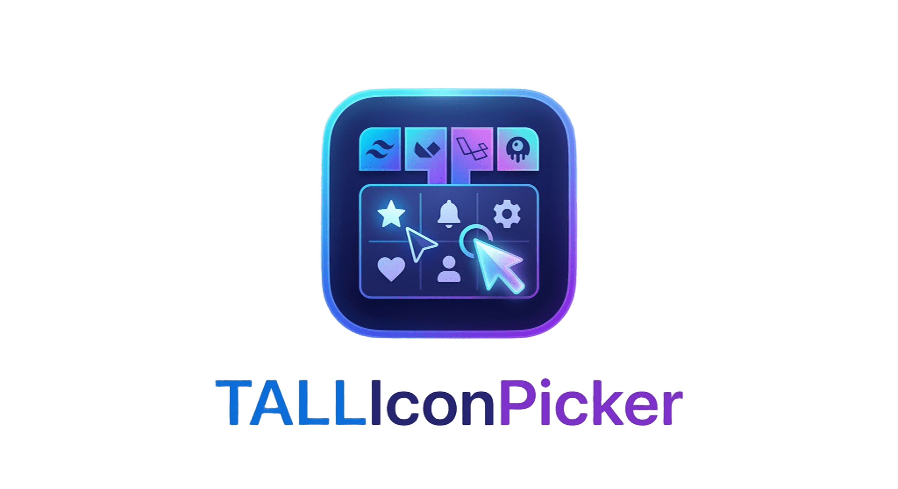

<p align="center">
  
</p>

<p align="center">
  
  
  
  
</p>

<p align="center">
  A highly optimized and extensible icon picker component for Laravel applications built on the <strong>TALL Stack</strong> (TailwindCSS, Alpine.js, Livewire, Laravel). Built with a focus on <strong>Clean Architecture</strong> and performance, this package delegates rendering to the <a href="https://github.com/driesvints/blade-icons">Blade Icons</a> engine and provides a modern interface that works with or without <a href="https://tallstackui.com/">TallStackUI</a>.
</p>

---

## 🚀 Architecture & Key Features

Unlike traditional pickers that load massive arrays into memory, **TALL Icon Picker** is designed to operate with low resource consumption through a *Service Layer* pattern:

| Feature | Description |
|---|---|
| **Optimized I/O (`IconDiscoveryService`)** | SVG file scanning runs in isolation, reading artifacts directly from the `vendor` directory only when requested. |
| **Lazy Loading & Pagination** | Thousands of icons are processed on demand and paginated in the backend, keeping the browser DOM and Livewire payload extremely lightweight. |
| **Dual UI Adapter** | Automatically detects whether TallStackUI is installed and routes to the appropriate Livewire view. Each adapter has a fully self-contained view: `icon-picker-tallstackui.blade.php` for TallStackUI and `icon-picker.blade.php` for the native Alpine.js/Tailwind experience. |
| **Extensibility (OCP)** | Open for extension via the config file (`config/tall-icon-picker.php`), allowing new icon libraries to be injected without modifying the package core. |
| **Batteries-Included** | Pre-configured for 15+ widely-used collections (Lucide, Phosphor, FontAwesome, Heroicons, etc.). |
| **i18n** | Native multi-language support. Ships with `en` and `pt_BR` — extensible by publishing the translation files. |

---

## ⚙️ Requirements

| Dependency | Version                             |
|---|-------------------------------------|
| PHP | `^8.3`                              |
| Laravel | `^11.0` or `^12.0`                  |
| Livewire | `^3.0` or `^4.0`                    |
| TallStackUI | `^2.0` *(optional — auto-detected)* |

---

## 📦 Installation

```bash
composer require matheusmarnt/tall-icon-picker
```

> **Note:** Composer will automatically install `blade-ui-kit/blade-icons` and all linked icon libraries. TallStackUI is a suggested dependency — if it is already installed in your project it will be used automatically; otherwise the native components will be activated.

### Updating

```bash
composer update matheusmarnt/tall-icon-picker
```

If you have previously published the config or views, re-publish them after updating to pick up any changes:

```bash
php artisan vendor:publish --tag="tall-icon-picker-config" --force
php artisan vendor:publish --tag="tall-icon-picker-views" --force
php artisan view:clear
```

---

## 🛠️ Configuration

The package works out of the box (**plug-and-play**). Publish the config file to customise the indexed libraries and the UI adapter:

```bash
php artisan vendor:publish --tag="tall-icon-picker-config"
```

The generated `config/tall-icon-picker.php` exposes two sections:

```php
return [

    /*
     | UI Adapter
     | 'auto'        — detects TallStackUI via class_exists (default)
     | 'tallstackui' — forces the x-ts-* components
     | 'native'      — forces the native Alpine.js/Tailwind components
     */
    'ui' => env('TALL_ICON_PICKER_UI', 'auto'),

    'libraries' => [
        'lucide'    => ['package' => 'mallardduck/blade-lucide-icons', 'path' => 'resources/svg', 'label' => 'Lucide'],
        'heroicons' => ['package' => 'blade-ui-kit/blade-heroicons',   'path' => 'resources/svg', 'label' => 'Heroicons'],
        // ...
    ],

];
```

To force a specific adapter via `.env`:

```dotenv
TALL_ICON_PICKER_UI=native      # always native
TALL_ICON_PICKER_UI=tallstackui # always TallStackUI
```

---

## 💻 Usage

### Via Blade Component (Recommended)

The Blade wrapper mounts the Livewire component and exposes the following props:

| Prop | Type | Default | Description |
|---|---|---|---|
| `wire:model` | `string` | — | Livewire property to bind the selected icon value |
| `label` | `string\|null` | `null` | Field label rendered above the trigger |
| `placeholder` | `string\|null` | `null` | Custom empty-state text inside the trigger field |
| `hint` | `string\|null` | `null` | Helper text below the field (hidden when a validation error is active) |

```html
<x-tall::icon-picker
    wire:model="system_icon"
    label="Module icon"
    placeholder="Select an icon..."
    hint="This icon will appear in the sidebar menu."
/>
```

**Validation errors** are displayed automatically — no extra configuration needed. The wrapper reads the `$errors` bag using the field name from `wire:model` and renders the error message below the field:

```php
// In the parent Livewire component
#[Validate('required|string')]
public string $system_icon = '';
```

```html
{{-- The error for 'system_icon' is shown automatically --}}
<x-tall::icon-picker wire:model="system_icon" label="Module icon" />
```

### Via Direct Livewire Tag

```html
{{-- Livewire v4 (dot notation) --}}
<livewire:tall.icon-picker wire:model="system_icon" />

{{-- Livewire v3 (double-colon notation) --}}
<livewire:tall::icon-picker wire:model="system_icon" />
```

> **Livewire v4 note:** Use `tall.icon-picker` (dot notation). Livewire v4 dropped support for `::` as a namespace separator in component tags. The `<x-tall::icon-picker>` Blade wrapper is unaffected and works with both versions.

> **Under the Hood:** When an icon is selected, the Livewire component dispatches an `icon-picked` browser event. An Alpine listener on the component's root element uses `Livewire.find()` to locate the parent Livewire component in the DOM and call `.set(property, value)` directly — compatible with Livewire v3 and v4.

---

## 🖼️ Rendering the Selected Icon in a View

The value stored by the `wire:model` property is the **full icon identifier** in the format `{prefix}-{name}` (e.g. `lucide-home`, `heroicon-o-user`). This identifier is directly compatible with the [Blade Icons](https://blade-ui-kit.com/blade-icons) ecosystem.

### Via `<x-dynamic-component>` (Recommended)

The most idiomatic approach — renders the full SVG via Blade:

```html
{{-- $system_icon = 'lucide-home' --}}
<x-dynamic-component :component="$system_icon" class="w-6 h-6 text-gray-700" />
```

### Via `svg()` Helper

The `svg()` helper provided by `blade-ui-kit/blade-icons` returns the SVG object and allows inline rendering with `toHtml()`:

```php
// Inside a Blade component or Livewire view
{!! svg($system_icon, 'w-6 h-6 text-indigo-500')->toHtml() !!}
```

### Via `@svg` Blade Directive

```html
@svg($system_icon, 'w-6 h-6')
```

### Full Example in a Livewire Component

```php
// app/Livewire/ModuleSettings.php
class ModuleSettings extends Component
{
    public string $system_icon = '';

    public function render(): View
    {
        return view('livewire.module-settings');
    }
}
```

```html
{{-- resources/views/livewire/module-settings.blade.php --}}

{{-- Picker --}}
<x-tall::icon-picker wire:model="system_icon" label="Module icon" />

{{-- Selected icon preview --}}
@if ($system_icon)
    <div class="mt-4 flex items-center gap-2 text-sm text-gray-600">
        <x-dynamic-component :component="$system_icon" class="w-5 h-5" />
        <span>{{ $system_icon }}</span>
    </div>
@endif
```

### Displaying in Tables / Listings

```html
{{-- $record->icon = 'phosphor-house' --}}
<td class="flex items-center gap-2">
    @if ($record->icon)
        <x-dynamic-component :component="$record->icon" class="w-4 h-4 text-indigo-500" />
    @endif
    {{ $record->name }}
</td>
```

> **Note:** Make sure the icon library matching the stored icon prefix is installed in the project that will render it. Otherwise `svg()` will throw an exception. Use `@if ($icon)` as a guard before rendering.

---

## 🎨 Advanced View Customisation

Publish the views to override the picker layout or empty states:

```bash
php artisan vendor:publish --tag="tall-icon-picker-views"
```

Views are placed in `resources/views/vendor/tall`. The two Livewire views can be customised independently:

| File | Description |
|---|---|
| `livewire/icon-picker.blade.php` | Native Alpine.js/Tailwind view |
| `livewire/icon-picker-tallstackui.blade.php` | TallStackUI (`x-ts-*`) view |

The shared UI adapter components (`ui/drawer`, `ui/button`, `ui/select`, `ui/input`) are used by the TallStackUI path and can also be customised individually.

### Publishing only the translations

```bash
php artisan vendor:publish --tag="tall-icon-picker-translations"
```

Language files are placed in `lang/vendor/tall-icon-picker/{locale}/icon-picker.php`.

---

## 🔧 Troubleshooting

**Newly installed icons do not appear**

```bash
php artisan view:clear
```

**SVG rendering at a disproportionate size**

The renderer applies the classes passed via `class=""`. Make sure your Tailwind utilities (`w-5 h-5`) are being compiled — add the `vendor` path to the `content` array in `tailwind.config.js` if needed.

**`x-dynamic-component` throwing `View not found`**

The Blade Icons component for that icon is not registered. Verify that the corresponding library is installed via Composer and that its `ServiceProvider` is being loaded.

**Native components without animations**

The native components use Alpine.js `x-cloak`. Add this to your global CSS:

```css
[x-cloak] { display: none !important; }
```

---

## 🤝 Contributing

Contributions are welcome! Before opening a Pull Request:

- Open an **Issue** first to discuss the bug or feature you'd like to address.
- Follow **Clean Code** guidelines and **PSR-12** formatting (enforced via [Laravel Pint](https://laravel.com/docs/12.x/pint)).
- All PRs must pass PHPStan (level 6) and the Pest test suite.
- Ensure the package passes the CI pipeline.
